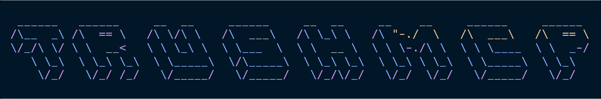

<div align="center">



# t-rush-mcp

**Speedrun your technical debt, now powered by AI.**

An MCP (Model Context Protocol) server that exposes the power of t-rush directly to AI coding assistants like Antigravity, Claude, and others. Let your AI agents find, prioritize, and fix TODO · FIXME · BUG comments across your codebase.

[](https://www.npmjs.com/package/@devds1989/t-rush-mcp)
[](./LICENSE)

</div>

---

## Why t-rush-mcp?

AI coding agents are great at fixing bugs, but they often struggle to know *what* to work on when left unattended. `t-rush-mcp` bridges this gap by exposing your codebase's technical debt directly to the AI through standard MCP tools.

Agents can now query your project for open TODOs, filter them by keyword, prioritize the oldest debt, and even increment your personal t-rush completion streak when they successfully resolve them.

---

## Features

- **`top_priority_todo`**: Feeds the agent all open TODO/FIXME comments so it can rank them by age and severity natively.
- **`search_todos`**: Allows the agent to fuzzy-search existing comments to find specific tasks.
- **`resolve_todo`**: Verifies the comment has been removed from the file and automatically increments the t-rush streak.
- **`scan_todos`**: Returns an unranked, raw list of all tech debt in a repository.
- **`get_streak_status`**: Exposes the user's current streak and stats to the agent.
- **`aggregate_debt`**: Summarizes the total debt across multiple local repositories.

---

## Install & Configuration

```json
{
  "mcpServers": {
    "t-rush": {
      "command": "npx",
      "args": ["-y", "@devds1989/t-rush-mcp"]
    }
  }
}
```

Or run it directly via npx:

```bash
npx -y @devds1989/t-rush-mcp
```

**Requirements:** Node.js 18+

---

## How it works

`t-rush-mcp` uses the shared `@devds1989/trush-core` logic to scan your codebase using the exact same parsers as the `t-rush` CLI. All streak updates and history modifications made by the AI agent are instantly synchronized with your local `~/.t-rush/data.json` database.

When an AI agent resolves a TODO, it increments your streak—teamwork!

---

## Supported languages

t-rush detects `TODO` and `FIXME` in all common comment styles:

| Style | Languages |
|---|---|
| `//` | JavaScript, TypeScript, Go, Rust, C, C++, Java, Kotlin, Swift, Dart |
| `#` | Python, Ruby, Shell, YAML, R, Perl, Elixir, Crystal |
| `--` | SQL, Lua, Haskell, Ada |
| `%` | Erlang, LaTeX |
| `;` | Lisp, Clojure, Assembly |
| `*` | Inside `/* */` block comments |

---

## Contributing

Contributions are welcome. Please open an issue before submitting a large PR.

```bash
git clone https://github.com/DevDs1989/trush-mcp
cd trush-mcp
npm install
npm run build
```

---

## License

[MIT](./LICENSE) © Dev
